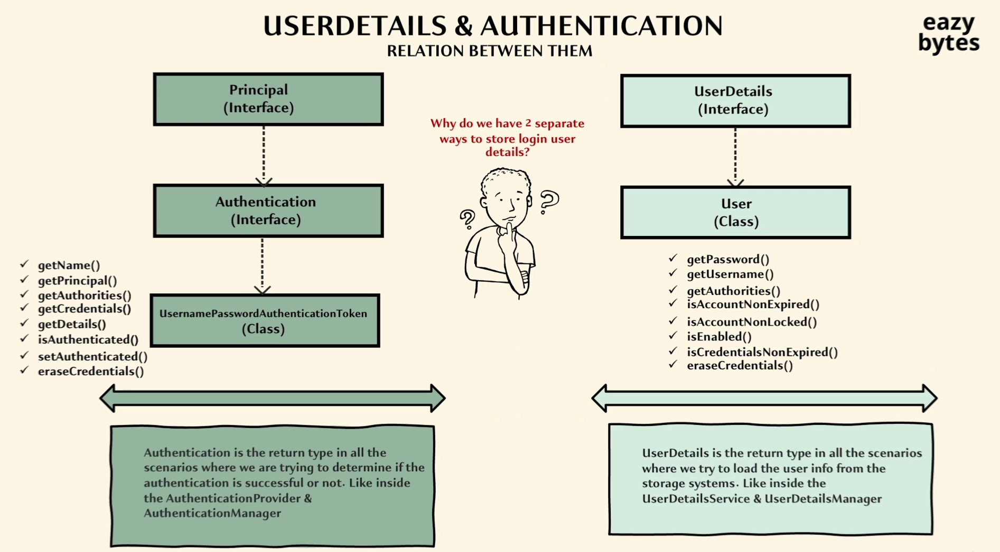
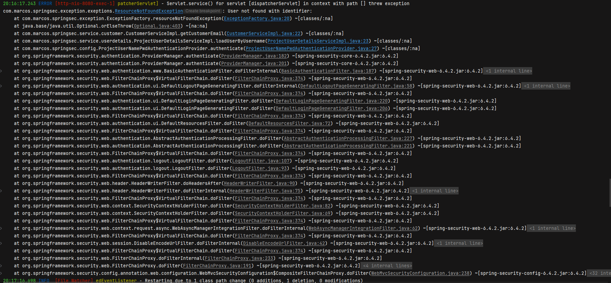

# Projeto: Aprendizado de Spring Security

## Índice
- [Introdução ao Projeto](#introdução-ao-projeto)
- [Configurações de Segurança](#configurações-de-segurança)
    - [ProjectSecurityConfiguration](#projectsecurityconfiguration)
    - [Gerenciamento de Usuários](#gerenciamento-de-usuários)
    - [Verificação de Senhas Comprometidas](#verificação-de-senhas-comprometidas)
    - [Hierarquia de Interfaces de Usuário](#hierarquia-de-interfaces-de-usuário)
- [](#userdetails-e-authentication-relação-entre-elas)
  - [Estrutura de herança](#estrutura-de-herança)
    - [Métodos importantes de UserNamePasswordAuthenticationToken](#métodos-importantes-de-usernamepasswordauthenticationtoken)
      - [Papel do Authentication](#papel-do-authentication)
  - [UserDetails](#userdetails)
    - [Papel do UserDetails](#papel-do-userdetails)
- [Autenticação utilizando jdbcUserDetailsManager](#autenticação-utilizando-jdbcuserdetailsmanager)
- [implementação de UserDetailsService para lógica de recuperação customizada](#implementação-de-userdetailsservice-para-logica-de-recuperacao-customizada)
- [Fluxo sequencial utilizando nossa propria implementação de UserDetailsService](#fluxo-sequencial-utilizando-nossa-própria-implementação-de-userdetailsservice)
- [Formas Diferentes de Privacidade de Dados](#formas-diferentes-de-privacidade-de-dados)
- [Múltiplas Estratégias com `DelegatingPasswordEncoder`](#múltiplas-estratégias-com-delegatingpasswordencoder)
- [Aceitando Apenas Tráfego HTTPS](#aceitando-apenas-tráfego-https)
- [Definindo `AuthenticationEntryPoint` customizado](#definindo-authenticationentrypoint-customizado)
- [Configuração no fluxo HTTP básico](#2-configuração-no-fluxo-http-básico)
- [Definindo AuthenticationEntryPoint Customizado](#definindo-authenticationentrypoint-customizado)
- [Definindo um AccessDeniedHandler Customizado](#definindo-um-accessdeniedhandler-customizado)
- [Lidando com Sessões no Spring Boot](#lidando-com-sessões-no-spring-boot)
  - [Tempo padrão da sessão](#tempo-padrão-da-sessão)
  - [Configuração do tempo de sessão](#configuração-do-tempo-de-sessão)
  - [Redirecionamento após expiração de sessão](#redirecionamento-após-expiração-de-sessão)
  - [Permitir acesso à URL de sessão expirada](#permitir-acesso-à-url-de-sessão-expirada)
- [Controle de Sessões Concorrentes](#controle-de-sessões-concorrentes)
- [Permitir Acesso à URL de Sessão Expirada](#permitir-acesso-à-url-de-sessão-expirada)
- [Proteção Contra Ataques de "Session Fixation"](#proteção-contra-ataques-de-session-fixation)
- [Por que usar `changeSessionId`?](#por-que-usar-changesessionid)
- [Configuração de Segurança no Spring Boot usando Frontend](#configuração-de-segurança-no-spring-boot-usando-frontend)
    - [1. Proteção de Rotas Autenticadas](#1-proteção-de-rotas-autenticadas)
    - [2. Rotas Públicas](#2-rotas-públicas)
    - [3. Página de Login Customizada](#3-página-de-login-customizada)
    - [4. Parâmetros Customizados de Login](#4-parâmetros-customizados-de-login)
    - [5. Redirecionamento Após Login](#5-redirecionamento-após-login)
    - [6. Handlers de Sucesso e Falha Customizados](#6-handlers-de-sucesso-e-falha-customizados)


  
  
 


---

 
## Introdução ao Projeto

(WIP) Este projeto foi criado com o objetivo de aprender e praticar o uso de Spring Security, desenvolvimento de backend com Spring Boot e frontend com Angular. Além disso, o projeto serve como referência para reutilizar trechos de código documentados.

---

## Configurações de Segurança

### ProjectSecurityConfiguration

`ProjectSecurityConfiguration` é a classe principal de configurações de segurança do projeto.

Por padrão, o Spring Security protege todas as rotas de uma aplicação web. Esse comportamento é gerenciado pelo método `defaultSecurityFilterChain(HttpSecurity httpSecurity)` da classe `SpringBootWebSecurityConfiguration`. No entanto, podemos personalizar esse comportamento para permitir ou restringir o acesso a diferentes endpoints. A implementação dessa personalização está na classe `ProjectSecurityConfiguration`.

#### Funcionalidades Principais

- Rotas definidas em `AUTHENTICATED_PATHS` exigem autenticação.
- Rotas definidas em `ALLOWED_PATHS` são acessíveis a todos os usuários sem autenticação.
- Suporte para:
    - Login baseado em formulário.
    - Autenticação HTTP Básica.

#### Anotação de Configuração

A classe utiliza a anotação `@Configuration`, que indica que define um ou mais beans de configuração gerenciados pelo container do Spring.

#### Configuração da Cadeia de Filtros de Segurança

```java
@Configuration
public class ProjectSecurityConfiguration {

    @Bean
    SecurityFilterChain securityFilterChain(HttpSecurity http) throws Exception {
        http.authorizeHttpRequests((request) -> request
                .requestMatchers(AUTHENTICATED_PATHS).authenticated()
                .requestMatchers(ALLOWED_PATHS).permitAll());
        http.formLogin(withDefaults());
        http.httpBasic(withDefaults());
        
        // Configurações adicionais podem ser incluídas aqui.
        return http.build();
    }
}
```

#### Detalhes do Login

- **Form Login:**
    - Ativado com `http.formLogin(withDefaults());`.
    - Extração de credenciais é feita pela classe `UsernamePasswordAuthenticationFilter` no método `Authentication attemptAuthentication(HttpServletRequest request, HttpServletResponse response)`.

- **HTTP Basic:**
    - Ativado com `http.httpBasic(withDefaults());`.
    - Processado pela classe `BasicAuthenticationFilter` no método `doFilterInternal(HttpServletRequest request, HttpServletResponse response, FilterChain chain)`.

> Nota: Sempre que o `formLogin` ou `httpBasic` forem desativados, utilize lambdas ou Method References para desativação, como em `http.formLogin(AbstractHttpConfigurer::disable)`. A chamada direta ao método `.disable()` está depreciada.

---

### Gerenciamento de Usuários

No Spring Security, é possível definir múltiplos usuários em memória para testes, utilizando `InMemoryUserDetailsManager` e a classe `UserDetails`. Este recurso é recomendado apenas para fins de desenvolvimento ou teste e não deve ser utilizado em produção.

#### Exemplo de Implementação

```java
@Bean
public InMemoryUserDetailsManager userDetailsManager() {
    UserDetails user1 = User.withDefaultPasswordEncoder()
            .username("user1")
            .password("password1")
            .roles("USER")
            .build();

    UserDetails user2 = User.withDefaultPasswordEncoder()
            .username("admin")
            .password("password2")
            .roles("ADMIN")
            .build();

    return new InMemoryUserDetailsManager(user1, user2);
}
```

---

### Verificação de Senhas Comprometidas

O Spring Security 6.3 introduziu o `CompromisedPasswordChecker`, que permite verificar se uma senha foi comprometida em violações de dados conhecidas. Essa funcionalidade é uma camada extra de segurança.

#### Exemplo de Configuração

```java
@Bean
public PasswordEncoder passwordEncoder() {
    return new BCryptPasswordEncoder();
}

@Bean
public CompromisedPasswordChecker passwordChecker() {
    return new CompromisedPasswordChecker();
}
```

---

### Hierarquia de Interfaces de Usuário

A representação de um usuário no Spring Security é feita através da interface `UserDetails`. Existem diferentes interfaces relacionadas para gerenciamento de usuários:

- **`UserDetailsService`**: Interface básica para carregar detalhes de um usuário.
    - Método principal: `UserDetails loadUserByUsername(String username)`.

- **`UserDetailsManager`**: Extensão de `UserDetailsService` com métodos adicionais para gerenciamento de usuários.
    - Principais métodos:
        - `void createUser(UserDetails user)`
        - `void updateUser(UserDetails user)`
        - `void deleteUser(String username)`
        - `void changePassword(String oldPassword, String newPassword)`
        - `boolean userExists(String username)`

- **Implementações Padrão**:
    1. `InMemoryUserDetailsManager`
    2. `JdbcUserDetailsManager`
    3. `LdapUserDetailsManager`


Classe disponível no pacote `com.marcos.springsec.config`. 

---
 
## UserDetails e Authentication: Relação entre Elas
 (*cortesia de eazybytes*)
### Estrutura de Herança
A relação entre `UserDetails` e `Authentication` é essencial no Spring Security para a autenticação e autorização de usuários.
`UserDetails` representa os dados do usuário, como nome, senha e permissões, carregados de um sistema de armazenamento por meio
de serviços como `UserDetailsService`.

Já `Authentication` encapsula o estado da autenticação, verificando se as credenciais fornecidas são válidas e garantindo
acesso controlado aos recursos. O processo conecta ambas as interfaces quando o `AuthenticationManager` ou `AuthenticationProvider`
usa instâncias de `UserDetails` para criar tokens de autenticação (`Authentication`), validando os dados do usuário e definindo
as permissões adequadas.

- **Principal (Interface)**
    - **Authentication (Interface)**
        - **UsernamePasswordAuthenticationToken (Class)**

### Métodos Importantes de `UsernamePasswordAuthenticationToken`
```java
class Ex{

    public static void main(String[] args) {
        UsernamePasswordAuthenticationToken authenticationToken =
                new UsernamePasswordAuthenticationToken("user", "password", List.of(new SimpleGrantedAuthority("ROLE_USER")));

        System.out.println(authenticationToken.getName()); // Retorna o nome do principal
        System.out.println(authenticationToken.getPrincipal()); // Retorna o objeto principal (geralmente UserDetails)
        System.out.println(authenticationToken.getAuthorities()); // Retorna as autoridades (roles)
        System.out.println(authenticationToken.getCredentials()); // Retorna as credenciais (ex.: senha)
        System.out.println(authenticationToken.getDetails()); // Detalhes adicionais (como IP)
        System.out.println(authenticationToken.isAuthenticated()); // Verifica se está autenticado

        // Configurações adicionais
        authenticationToken.setAuthenticated(true);
        authenticationToken.eraseCredentials(); // Remove informações sensíveis como senha

    }
}
```

### Papel do `Authentication`
- **`Authentication`** é usado para determinar se a autenticação foi bem-sucedida ou não.
- Componente essencial para:
    - **`AuthenticationProvider`**: Realiza a autenticação.
    - **`AuthenticationManager`**: Coordena o processo de autenticação.

Exemplo de `AuthenticationManager`:
```java
@Autowired
private AuthenticationManager authenticationManager;

public Authentication authenticateUser(String username, String password) {
    UsernamePasswordAuthenticationToken token = new UsernamePasswordAuthenticationToken(username, password);
    return authenticationManager.authenticate(token);
}
```

---

## UserDetails

### Estrutura de Herança
A interface `UserDetails` é usada para representar as informações de um usuário no sistema.
- **UserDetails (Interface)**
    - **User (Class)**

### Métodos Importantes de `User`
```java

class Ex{
    public static void main(String[] args) {

        UserDetails user = User.builder()
                .username("john_doe")
                .password(new BCryptPasswordEncoder().encode("password"))
                .roles("USER")
                .build();

        System.out.println(user.getUsername()); // Nome de usuário
        System.out.println(user.getPassword()); // Senha codificada
        System.out.println(user.getAuthorities()); // Autoridades atribuídas ao usuário
        System.out.println(user.isAccountNonExpired()); // Verifica se a conta está expirada
        System.out.println(user.isAccountNonLocked()); // Verifica se a conta está bloqueada
        System.out.println(user.isCredentialsNonExpired()); // Verifica se as credenciais estão expiradas
        System.out.println(user.isEnabled()); // Verifica se o usuário está habilitado
    }
}
```

### Papel do `UserDetails`
- **`UserDetails`** é usado para carregar informações de usuários de sistemas de armazenamento, como banco de dados ou memória.
- Componente essencial para:
    - **`UserDetailsService`**: Carrega informações do usuário com base no nome de usuário.
      ```java
      @Service
      public class CustomUserDetailsService implements UserDetailsService {
  
          @Override
          public UserDetails loadUserByUsername(String username) throws UsernameNotFoundException {
              if (username.equals("john_doe")) {
                  return User.builder()
                          .username("john_doe")
                          .password(new BCryptPasswordEncoder().encode("password"))
                          .roles("USER")
                          .build();
              }
              throw new UsernameNotFoundException("Usuário não encontrado");
          }
      }
      ```
    - **`UserDetailsManager`**: Adiciona funcionalidade para gerenciar usuários (criar, atualizar, excluir).

### Comportamento Padrão
Caso não haja um `AuthenticationProvider` configurado, o framework usará o **`DaoAuthenticationProvider`** por padrão, que depende de um `UserDetailsService` para carregar os detalhes do usuário.

Exemplo de configuração padrão:
```java
@Configuration
public class SecurityConfig {

    @Bean
    public AuthenticationManager authenticationManager(AuthenticationConfiguration configuration) throws Exception {
        return configuration.getAuthenticationManager();
    }

    @Bean
    public UserDetailsService userDetailsService() {
        return new InMemoryUserDetailsManager(
                User.builder()
                        .username("user")
                        .password(new BCryptPasswordEncoder().encode("password"))
                        .roles("USER")
                        .build()
        );
    }
}
```

## Autenticação utilizando JdbcUserDetailsManager

Ao invés de criarmos usuários em memória, podemos armazená-los no banco de dados utilizando o `JdbcUserDetailsManager`. Isso nos permite gerenciar credenciais e permissões diretamente no banco, de forma mais escalável.

### Configuração básica
Para usar o `JdbcUserDetailsManager`, criamos um bean no arquivo de configuração:

```java
@Bean
public UserDetailsService userDetailsService(DataSource dataSource) {
    return new JdbcUserDetailsManager(dataSource);
}
```

Com essa configuração, o Spring Security espera que o banco de dados contenha as tabelas necessárias para armazenar usuários e suas autoridades (permissões). Essas tabelas podem ser criadas manualmente ou geradas automaticamente com base no esquema esperado pelo `JdbcUserDetailsManager`.

### Esquema de tabelas esperado
Por padrão, o `JdbcUserDetailsManager` utiliza as tabelas `users` e `authorities` com as seguintes definições básicas:

#### Tabela `users`
```sql
CREATE TABLE users (
    username VARCHAR(50) NOT NULL PRIMARY KEY,
    password VARCHAR(100) NOT NULL,
    enabled BOOLEAN NOT NULL
);
```

#### Tabela `authorities`
```sql
CREATE TABLE authorities (
    username VARCHAR(50) NOT NULL,
    authority VARCHAR(50) NOT NULL,
    FOREIGN KEY (username) REFERENCES users(username)
);
```

### Inserção de dados no banco de dados
Após criar as tabelas, inserimos os usuários e suas autoridades manualmente ou via script. Por exemplo:

```sql
-- Inserir usuário
INSERT INTO users (username, password, enabled) VALUES ('user1', '{bcrypt}$2a$10$Wq7gJnVxzP1uIzDjH7VbAe3RLefpssRV18y6qFZHD9BoqVQ44.sni', true);

-- Inserir autoridade
INSERT INTO authorities (username, authority) VALUES ('user1', 'ROLE_USER');
```

O campo `password` deve conter uma senha codificada (ex.: BCrypt). Podemos usar um `PasswordEncoder` para gerar essas senhas no Java.

---

## UserDetailsService implementation para lógica de recuperação customizada

Quando precisamos carregar detalhes de usuários com base em nossas próprias tabelas, colunas ou lógica, devemos criar uma implementação customizada de `UserDetailsService`. Isso é útil para integrar o Spring Security com um modelo de dados específico do negócio.

### Interface personalizada
Criamos uma interface que estenda `UserDetailsService`:

```java
public interface ProjectUserDetailsService extends UserDetailsService {
}
```

### Implementação customizada
Em seguida, implementamos a lógica personalizada no método `loadUserByUsername`:

```java
@Service
@RequiredArgsConstructor
public class ProjectUserDetailsServiceImpl implements ProjectUserDetailsService {

    private final CustomerService customerService;

    @Override
    public UserDetails loadUserByUsername(String username) throws UsernameNotFoundException {
        // Buscar o cliente no banco de dados usando um serviço específico
        var customer = customerService.getCustomerEmail(username);

        // Converter o papel do cliente em GrantedAuthority
        List<GrantedAuthority> grantedAuthorities = List.of(
            new SimpleGrantedAuthority(customer.getRole())
        );

        // Retornar o objeto User do Spring Security
        return new User(
            customer.getEmail(),
            customer.getPassword(),
            grantedAuthorities
        );
    }
}
```

### Integração com o banco de dados
A lógica de busca é delegada ao `CustomerService`, que se comunica diretamente com o repositório:

```java
@Service
@RequiredArgsConstructor
public class CustomerServiceImpl implements CustomerService {

    private final CustomerRepository customerRepository;

    @Override
    public Customer getCustomerEmail(String email) {
        return customerRepository.findByEmail(email).orElseThrow(
            () -> new UsernameNotFoundException("Usuário não encontrado com email: " + email)
        );
    }
}
```

### Exemplo de esquema para uma tabela customizada
Caso utilizemos uma tabela personalizada, ela pode ser estruturada assim:

```sql
CREATE TABLE customers (
    id BIGINT AUTO_INCREMENT PRIMARY KEY,
    email VARCHAR(50) NOT NULL UNIQUE,
    password VARCHAR(100) NOT NULL,
    role VARCHAR(50) NOT NULL
);
```
## Fluxo Sequencial utilizando nossa Própria Implementação de UserDetailsService

### Passo a Passo do Fluxo de Autenticação

1. **Usuário tenta acessar a página segura**\
   O usuário tenta acessar um recurso protegido na aplicação, como uma página que exige autenticação.

2. **Filtros do Spring identificam que o usuário não está logado**\
   Filtros como `AuthorizationFilter`, `AbstractAuthenticationProcessingFilter` e `DefaultLoginPageGeneratingFilter` verificam que o usuário não possui uma sessão ativa e o redirecionam para a página de login.

3. **Usuário envia suas credenciais**\
   O usuário insere o nome de usuário e senha e submete a requisição de login, que é interceptada pelos filtros de autenticação do Spring Security.

4. **Requisição interceptada e credenciais processadas**\
   Filtros como `UsernamePasswordAuthenticationFilter` extraem o nome de usuário e senha da requisição e criam um objeto `UsernamePasswordAuthenticationToken`. Esse objeto é uma implementação da interface `Authentication`.

5. **ProviderManager autentica o token**\
   O `ProviderManager`, que é uma implementação de `AuthenticationManager`, verifica qual provedor de autenticação suporta o tipo do token criado. Normalmente, o método `authenticate()` do `DaoAuthenticationProvider` é invocado.

6. **Carregamento de detalhes do usuário**\
   O `DaoAuthenticationProvider` chama o método `loadUserByUsername` da implementação customizada de `UserDetailsService` (como `ProjectUserDetailsServiceImpl`) para carregar os detalhes do usuário a partir do banco de dados ou outra fonte.

    - **Exemplo de implementação:**
      ```java
      @Service
      @RequiredArgsConstructor
      public class ProjectUserDetailsServiceImpl implements UserDetailsService {
 
          private final CustomerService customerService;
 
          @Override
          public UserDetails loadUserByUsername(String username) throws UsernameNotFoundException {
              var customer = customerService.getCustomerEmail(username);
              List<GrantedAuthority> authorities = List.of(
                  new SimpleGrantedAuthority(customer.getRole())
              );
              return new User(customer.getEmail(), customer.getPassword(), authorities);
          }
      }
      ```

7. **Validação das credenciais**\
   Após carregar os detalhes do usuário, o `DaoAuthenticationProvider` utiliza um `PasswordEncoder` para comparar a senha informada com a senha armazenada. Se as senhas coincidirem, a autenticação é considerada bem-sucedida.

8. **Objeto de autenticação retornado**\
   Um objeto `Authentication` contendo os detalhes do sucesso ou falha da autenticação é retornado para o `ProviderManager`.

9. **Resultado da autenticação avaliado pelo ProviderManager**\
   O `ProviderManager` verifica se a autenticação foi bem-sucedida:

    - Se não for, tenta outros provedores de autenticação disponíveis.
    - Caso contrário, retorna os detalhes de autenticação para os filtros.

10. **Sessão autenticada armazenada**\
    O objeto `Authentication` é armazenado no `SecurityContext` pelo filtro apropriado para uso futuro na aplicação. Uma resposta apropriada (como redirecionamento ou exibição de conteúdo) é enviada ao usuário.

## Formas Diferentes de Privacidade de Dados

## 1. Encoding
Encoding é o processo de converter dados de uma forma para outra, sem relação com criptografia. Ele não deve ser utilizado para proteger dados, pois:
- Não envolve segredos e é completamente reversível.
- Exemplos comuns de encoding: **ASCII**, **BASE64**, **UNICODE**.

### Exemplo de Uso no Java:
```java
import java.util.Base64;

public class EncodingExample {
    public static void main(String[] args) {
        String originalInput = "password123";
        String encodedString = Base64.getEncoder().encodeToString(originalInput.getBytes());

        System.out.println("Encoded: " + encodedString);

        String decodedString = new String(Base64.getDecoder().decode(encodedString));
        System.out.println("Decoded: " + decodedString);
    }
}
```

---

## 2. Encryption
A encriptação transforma dados para garantir a **confidencialidade** e requer o uso de uma **chave** para reverter o processo (decriptação). A segurança depende da confidencialidade da chave.

### Exemplo de Uso no Java:
```java
import javax.crypto.Cipher;
import javax.crypto.KeyGenerator;
import javax.crypto.SecretKey;

public class EncryptionExample {
    public static void main(String[] args) throws Exception {
        String data = "password123";

        // Gerar uma chave secreta
        KeyGenerator keyGen = KeyGenerator.getInstance("AES");
        keyGen.init(128);
        SecretKey secretKey = keyGen.generateKey();

        // Encriptar
        Cipher cipher = Cipher.getInstance("AES");
        cipher.init(Cipher.ENCRYPT_MODE, secretKey);
        byte[] encryptedData = cipher.doFinal(data.getBytes());
        System.out.println("Encrypted: " + new String(encryptedData));

        // Decriptar
        cipher.init(Cipher.DECRYPT_MODE, secretKey);
        byte[] decryptedData = cipher.doFinal(encryptedData);
        System.out.println("Decrypted: " + new String(decryptedData));
    }
}
```

---

## 3. Hashing
Hashing converte dados em um valor hash de forma irreversível. Ele é utilizado para verificar se o *input* corresponde ao valor original sem precisar armazenar os dados originais.

### Exemplo de Uso no Java com BCrypt:
```java
import org.springframework.security.crypto.bcrypt.BCryptPasswordEncoder;

public class HashingExample {
    public static void main(String[] args) {
        // Podemos também defir um @Bean de password encoder para deixarmos disponível no boot da aplicação
        BCryptPasswordEncoder passwordEncoder = new BCryptPasswordEncoder();
        String rawPassword = "password123";
        
        // Gerar hash
        String hashedPassword = passwordEncoder.encode(rawPassword);
        System.out.println("Hashed: " + hashedPassword);

        // Verificar hash
        boolean matches = passwordEncoder.matches(rawPassword, hashedPassword);
        System.out.println("Password matches: " + matches);
    }
}
```

---

## Múltiplas Estratégias com `DelegatingPasswordEncoder`
O `DelegatingPasswordEncoder` permite gerenciar múltiplos tipos de hash simultaneamente, sendo útil para migração de algoritmos de hashing.

### Como Funciona:
- Durante o cadastro, o `DelegatingPasswordEncoder` usa o *encoder* padrão e adiciona o prefixo correspondente ao algoritmo.
- Durante o login, o método `matches()` delega a validação ao *encoder* correto com base no prefixo da senha (ex.: `{bcrypt}`).

### Exemplo de Configuração no Spring Boot:
```java
import org.springframework.security.crypto.password.PasswordEncoder;
import org.springframework.security.crypto.factory.PasswordEncoderFactories;

public class DelegatingPasswordEncoderExample {
    @Bean
    PasswordEncoder passwordEncoder() {
        return PasswordEncoderFactories.createDelegatingPasswordEncoder();
    }
}
```

### Explicação:
- O `DelegatingPasswordEncoder` usa o prefixo (ex.: `{bcrypt}`) para determinar qual `PasswordEncoder` utilizar.
- Ele permite combinar algoritmos antigos e novos durante uma migração de sistema.

---
## Authentication Provider

No Spring Security, o `AuthenticationProvider` é responsável por lidar com a lógica de autenticação. Ele abstrai o processo de validação das credenciais do usuário e oferece flexibilidade para implementar soluções customizadas quando necessário.

## Exemplos de Cenários com AuthenticationProvider

### 1. Autenticação com Username e Senha
O `AuthenticationProvider` padrão utiliza o `UserDetailsService` para localizar o usuário no sistema e o `PasswordEncoder` para validar a senha. Esse é o caso mais comum de autenticação.

**Exemplo:**
```java
@Component
public class CustomAuthenticationProvider implements AuthenticationProvider {

    @Autowired
    private UserDetailsService userDetailsService;

    @Autowired
    private PasswordEncoder passwordEncoder;

    @Override
    public Authentication authenticate(Authentication authentication) throws AuthenticationException {
        String username = authentication.getName();
        String password = authentication.getCredentials().toString();

        UserDetails userDetails = userDetailsService.loadUserByUsername(username);

        if (passwordEncoder.matches(password, userDetails.getPassword())) {
            return new UsernamePasswordAuthenticationToken(username, password, userDetails.getAuthorities());
        } else {
            throw new BadCredentialsException("Senha inválida");
        }
    }

    @Override
    public boolean supports(Class<?> authentication) {
        return UsernamePasswordAuthenticationToken.class.isAssignableFrom(authentication);
    }
}
```

### 2. Autenticação OAUTH2
Em um cenário de autenticação OAUTH2, podemos implementar um `AuthenticationProvider` que valida tokens de acesso recebidos.

**Exemplo:**
```java
@Component
public class OAuth2AuthenticationProvider implements AuthenticationProvider {

    @Autowired
    private OAuth2TokenValidator tokenValidator;

    @Override
    public Authentication authenticate(Authentication authentication) throws AuthenticationException {
        String token = authentication.getCredentials().toString();

        if (tokenValidator.validate(token)) {
            return new OAuth2AuthenticationToken(token, null, List.of(new SimpleGrantedAuthority("ROLE_USER")));
        } else {
            throw new BadCredentialsException("Token inválido");
        }
    }

    @Override
    public boolean supports(Class<?> authentication) {
        return OAuth2AuthenticationToken.class.isAssignableFrom(authentication);
    }
}
```

### 3. Autenticação JAAS (Java Authentication and Authorization Service)
Para sistemas que utilizam JAAS, um `AuthenticationProvider` pode integrar diretamente com este framework.

**Exemplo:**
```java
@Component
public class JAASAuthenticationProvider implements AuthenticationProvider {

    @Override
    public Authentication authenticate(Authentication authentication) throws AuthenticationException {
        String username = authentication.getName();
        String password = authentication.getCredentials().toString();

        // Integração com JAAS
        try {
            LoginContext loginContext = new LoginContext("MyApp", new UsernamePasswordCallbackHandler(username, password));
            loginContext.login();

            return new UsernamePasswordAuthenticationToken(username, password, List.of(new SimpleGrantedAuthority("ROLE_USER")));
        } catch (LoginException e) {
            throw new BadCredentialsException("Falha na autenticação via JAAS", e);
        }
    }

    @Override
    public boolean supports(Class<?> authentication) {
        return UsernamePasswordAuthenticationToken.class.isAssignableFrom(authentication);
    }
}
```

## Detalhes da Interface AuthenticationProvider

A interface `AuthenticationProvider` define dois métodos principais:

```java
public interface AuthenticationProvider {

    Authentication authenticate(Authentication authentication) throws AuthenticationException;

    boolean supports(Class<?> authentication);
}
```

### Método `authenticate`
O método `authenticate()` recebe um objeto `Authentication` contendo as credenciais do usuário e retorna um novo objeto `Authentication` caso a autenticação seja bem-sucedida. Caso contrário, lança uma exceção do tipo `AuthenticationException`.

**Exemplo de uso:**
```java
@Override
public Authentication authenticate(Authentication authentication) throws AuthenticationException {
    // Lógica de autenticação customizada
}
```

### Método `supports`
O método `supports()` determina se o `AuthenticationProvider` suporta o tipo de objeto `Authentication` recebido.

**Exemplo de implementação:**
```java
@Override
public boolean supports(Class<?> authentication) {
    return UsernamePasswordAuthenticationToken.class.isAssignableFrom(authentication);
}
```

Esse método é útil para garantir que o `AuthenticationProvider` correto seja utilizado no momento da autenticação.

## Gerenciamento de AuthenticationProviders
No Spring Security, o `ProviderManager` é a implementação padrão do `AuthenticationManager`. Ele delega a autenticação para uma lista de `AuthenticationProvider` registrados, tentando autenticar o usuário com cada um deles até que um sucesso seja alcançado ou todas as tentativas falhem.


### Aceitando Apenas Tráfego HTTPS

Ativar **HTTPS** em nossa aplicação é crucial para garantir a confidencialidade e integridade dos dados durante a comunicação entre clientes e servidores. Por criptografar os dados transmitidos, o **HTTPS** previne ataques como *eavesdropping* e *man-in-the-middle*.

O **Spring Security** oferece uma integração simples para garantir que apenas tráfego **HTTPS** seja aceito em nossa aplicação. Abaixo está um exemplo de configuração que permite apenas tráfego seguro:

```java
@Bean
SecurityFilterChain defaultSecurityFilterChain(HttpSecurity http) throws Exception {
    http.requiresChannel(rcf -> rcf.anyRequest().requiresSecure()) // Exige HTTPS
        .authorizeHttpRequests((requests) -> requests
            .requestMatchers("/public/**").permitAll() // Permite rotas públicas
            .anyRequest().authenticated());           // Requer autenticação para outras rotas
    return http.build();
}
```

Se em algum cenário específico for necessário aceitar apenas tráfego **HTTP**, podemos invocar o método `requiresInsecure()` ao invés de `requiresSecure()`.

### Resumo
- **HTTPS** protege contra interceptações e alterações de dados.
- Configurar o **Spring Security** para exigir **HTTPS** é uma prática essencial para aplicações seguras.
- Em casos excepcionais, podemos optar por aceitar tráfego **HTTP** usando `requiresInsecure()`, mas isso deve ser feito com cautela.

## Erro

Mesmo com minhas ratativas de erro com o ExceptionFactory e resourceNotFoundException, estáva recebendo esse erro não tratado

O código que estava causando o erro:
```java

package com.marcos.springsec.service.userdetails;

import com.marcos.springsec.service.customer.CustomerService;
import lombok.RequiredArgsConstructor;
import org.springframework.security.core.GrantedAuthority;
import org.springframework.security.core.authority.SimpleGrantedAuthority;
import org.springframework.security.core.userdetails.User;
import org.springframework.security.core.userdetails.UserDetails;
import org.springframework.security.core.userdetails.UsernameNotFoundException;
import org.springframework.stereotype.Service;

import java.util.List;

@Service
@RequiredArgsConstructor
public class ProjectUserDetailsServiceImpl implements ProjectUserDetailsService{

    private final CustomerService customerService;

    @Override
    public UserDetails loadUserByUsername(String username) throws UsernameNotFoundException {

        var customer = customerService.getCustomerEmail(username);

        List<GrantedAuthority> grantedAuthorities = List.of(new SimpleGrantedAuthority(customer.getRole()));

        return new User(customer.getEmail(), customer.getPassword(), grantedAuthorities);
    }
}

```

O motivo pelo qual um erro **Internal Server Error (HTTP 500)** é gerado quando o `loadUserByUsername` não encontra um usuário é que a exceção lançada pelo método `getCustomerEmail` é a **`ResourceNotFoundException`**, mas essa exceção não está sendo capturada explicitamente no fluxo do `AuthenticationProvider`.

Por padrão, o Spring Security espera que erros relacionados à autenticação lancem subclasses de **`AuthenticationException`** (como `UsernameNotFoundException`, `BadCredentialsException`, etc.). Como a exceção lançada (`ResourceNotFoundException`) não estende `AuthenticationException`, o Spring a trata como uma exceção inesperada, resultando em um erro HTTP 500.

### Solução
Para corrigir esse comportamento, devemos garantir que o método `loadUserByUsername` do `ProjectUserDetailsServiceImpl` lance uma exceção que seja uma subclasse de `AuthenticationException` quando um usuário não for encontrado. Podemos fazer isso ao capturar a `ResourceNotFoundException` e lançando uma `UsernameNotFoundException`, por exemplo:

```java
@Override
public UserDetails loadUserByUsername(String username) throws UsernameNotFoundException {
    try {
        var customer = customerService.getCustomerEmail(username);
        List<GrantedAuthority> grantedAuthorities = List.of(new SimpleGrantedAuthority(customer.getRole()));
        return new User(customer.getEmail(), customer.getPassword(), grantedAuthorities);
    } catch (ResourceNotFoundException ex) {
        throw new UsernameNotFoundException("User not found: " + username, ex);
    }
}
```

### Por que usar `UsernameNotFoundException`?
O `UsernameNotFoundException` é uma subclasse de `AuthenticationException` e é especificamente projetado para indicar que o usuário não foi encontrado durante o processo de autenticação. O Spring Security irá capturar essa exceção e gerar corretamente uma resposta HTTP 401 (Unauthorized), ao invés de 500.

### Resultado esperado
Após a modificação, se um usuário não for encontrado:
1. O `loadUserByUsername` lançará uma `UsernameNotFoundException`.
2. O Spring Security retornará um HTTP 401 com uma mensagem apropriada.
3. O comportamento estará alinhado às práticas recomendadas do Spring Security.


### Definindo AuthenticationEntryPoint Customizado

Abaixo estão os trechos de código para definir a customização do `AuthenticationEntryPoint` para o fluxo HTTP **básico**:

### 1. Implementação da classe `AuthenticationEntryPoint`

Precisamos criar a implementação da classe utilizando a interface `AuthenticationEntryPoint` e sobrescrever o método `commence()`. Dentro do método `commence`, podemos criar a lógica responsável por enviar a resposta de volta ao cliente com base nos requisitos definidos.

```java
public class CustomBasicAuthenticationEntryPoint implements AuthenticationEntryPoint {

    @Override
    public void commence(HttpServletRequest request, HttpServletResponse response, AuthenticationException authException) throws IOException {
        response.setHeader("project-error-reason", "Authentication failed");
        response.sendError(HttpStatus.UNAUTHORIZED.value(), authException.getMessage());
    }
}
```

### 2. Configuração no fluxo HTTP básico

A classe `CustomBasicAuthenticationEntryPoint` criada pode ser configurada para o fluxo HTTP básico (`httpBasic`). Uma estratégia similar pode ser seguida para o fluxo de `formLogin`:

```java
http.httpBasic(hbc -> hbc.authenticationEntryPoint(new CustomBasicAuthenticationEntryPoint()));
```


## Definindo um AccessDeniedHandler Customizado

Este guia demonstra como criar e configurar um AccessDeniedHandler personalizado no Spring Security. Essa abordagem permite definir uma lógica específica para lidar com respostas de acesso negado (403) conforme os requisitos do seu projeto.

### Etapas para Customização

#### 1. Criar uma implementação de `AccessDeniedHandler`

Crie uma classe que implemente a interface `AccessDeniedHandler` e sobrescreva o método `handle()`. Dentro deste método, você pode definir a lógica para a resposta que será enviada ao cliente.

```java
import org.springframework.http.HttpStatus;
import org.springframework.security.access.AccessDeniedException;
import org.springframework.security.web.access.AccessDeniedHandler;

import javax.servlet.ServletException;
import javax.servlet.http.HttpServletRequest;
import javax.servlet.http.HttpServletResponse;
import java.io.IOException;

public class CustomAccessDeniedHandler implements AccessDeniedHandler {

    @Override
    public void handle(HttpServletRequest request, HttpServletResponse response, AccessDeniedException accessDeniedException) throws IOException, ServletException {
        response.setHeader("project-denied-reason", "Authorization failed");
        response.setStatus(HttpStatus.FORBIDDEN.value());
    }
}
```

#### 2. Configurar o `CustomAccessDeniedHandler`

Após criar a classe personalizada, configure-a em sua aplicação utilizando o método `exceptionHandling()` no `HttpSecurity`.

```java
import org.springframework.security.config.annotation.web.builders.HttpSecurity;

public class SecurityConfig {

    protected void configure(HttpSecurity http) throws Exception {
        http
            .exceptionHandling(exception ->
                exception.accessDeniedHandler(new CustomAccessDeniedHandler())
                //.accessDeniedPage("/") // Descomente esta linha para redirecionar para uma página específica em aplicações com UI
            );
    }
}
```

##### Observações:

- **Para Aplicações REST:**
    - Não é necessário utilizar o método `.accessDeniedPage()` em APIs REST, pois a resposta já será enviada no formato JSON ou conforme definido no `CustomAccessDeniedHandler`.

- **Para Aplicações com UI:**
    - Caso esteja lidando com uma interface de usuário, você pode ativar o redirecionamento para uma página específica utilizando `.accessDeniedPage()`. Isso é útil para exibir uma página de erro amigável ao usuário.
 
 
## Lidando com Sessões no Spring Boot

### Tempo padrão da sessão
No Spring Security, o tempo padrão de expiração da sessão é de **30 minutos**, controlado pelo cookie `JSESSIONID`.

### Configuração do tempo de sessão
Podemos configurar o tempo de expiração da sessão no arquivo de propriedades ou em variáveis de ambiente, utilizando o seguinte parâmetro:

```properties
server.servlet.session.timeout=${SESSION_TIMEOUT:10m}
```

- O tempo mínimo permitido é **1 minuto e 20 segundos**.

### Redirecionamento após expiração de sessão
Podemos definir uma URL específica para onde o usuário será redirecionado após a expiração da sessão. Isso é feito utilizando o método `invalidSessionUrl`:

```java
http.sessionManagement(session -> 
    session.invalidSessionUrl(INVALID_SESSION)
);
```

### Permitir acesso à URL de sessão expirada
Certifique-se de liberar o acesso à URL configurada para sessões expiradas adicionando-a aos caminhos permitidos no `SecurityFilterChain`:

```java
http.authorizeHttpRequests(auth -> 
    auth.requestMatchers(ALLOWED_PATHS).permitAll()
);
```

### Controle de sessões concorrentes
Também podemos limitar o número máximo de sessões concorrentes permitidas para um usuário e configurar o comportamento ao exceder esse limite. Isso é útil para garantir segurança e impedir que a mesma conta seja usada simultaneamente em vários dispositivos ou navegadores.

Exemplo de configuração:

```java
http.sessionManagement(session -> 
    session.invalidSessionUrl(INVALID_SESSION)
           .maximumSessions(1) // Limite de 1 sessão concorrente
           .maxSessionsPreventsLogin(true) // Impede o login em novas sessões
);
```

- **`maximumSessions(1)`**: Define o limite máximo de sessões concorrentes (neste caso, 1).
- **`maxSessionsPreventsLogin(true)`**: Quando `true`, impede que um novo login substitua uma sessão existente. Se `false`, a nova sessão substitui a anterior, invalidando-a.

### Permitir acesso à URL de sessão expirada
Certifique-se de liberar o acesso à URL configurada para sessões expiradas adicionando-a aos caminhos permitidos no `SecurityFilterChain`:

```java
http.authorizeHttpRequests(auth -> 
    auth.requestMatchers(ALLOWED_PATHS).permitAll()
);
```
## Proteção Contra Ataques de "Session Fixation"

No Spring Security, é possível configurar o gerenciamento de sessão para evitar ataques de "session fixation". Esse tipo de ataque ocorre quando um atacante força uma vítima a usar um ID de sessão que ele já conhece, permitindo que o atacante roube a sessão após o login.

Para configurar o gerenciamento de sessões e proteger contra ataques de "session fixation", use o método `http.sessionManagement` e configure a propriedade `sessionFixation`. Veja um exemplo abaixo:

```java
import org.springframework.context.annotation.Bean;
import org.springframework.security.config.annotation.web.builders.HttpSecurity;
import org.springframework.security.web.SecurityFilterChain;

@Bean
public SecurityFilterChain securityFilterChain(HttpSecurity http) throws Exception {
    http
        .sessionManagement(smc -> smc
            .sessionFixation(sfc -> sfc.changeSessionId()) // Gera um novo ID de sessão ao autenticar
        )
        .authorizeRequests(authz -> authz
            .anyRequest().authenticated()
        );
    return http.build();
}
```

### Opções para `sessionFixation`

- `changeSessionId()`: Gera um novo ‘ID’ de sessão para cada sessão autenticada, preservando os atributos da sessão original.
- `migrateSession()`: Semelhante a `changeSessionId`, mas pode ser usado para manter a compatibilidade com versões mais antigas.
- `newSession()`: Cria uma sessão completamente, descartando qualquer dado armazenado anteriormente.
- `none()`: Não faz alterações no ‘ID’ da sessão (não recomendado).

### Por que usar `changeSessionId`?

A opção `changeSessionId` é a recomendada, pois fornece uma boa proteção contra ataques de "session fixation" ao mesmo tempo que mantém os atributos existentes na sessão. Isso é especialmente útil em aplicações onde o estado do utilizador é armazenado na sessão.

Com essas configurações, a nossa aplicação estará mais segura contra este tipo de vulnerabilidade.

## Configuração de Segurança no Spring Boot usando Frontend

Código utilizado:
```java
@Configuration
@RequiredArgsConstructor
public class ProjectSecurityConfig {

    private final CustomAuthenticationSuccessHandler success;
    private final CustomAuthenticationFailureHandler failure;

    @Bean
    SecurityFilterChain defaultSecurityFilterChain(HttpSecurity http) throws Exception {

        http.csrf((csrf) -> csrf.disable())
                .authorizeHttpRequests((requests) -> requests.requestMatchers("/dashboard").authenticated() //1. trocamos de permitAll para authenticated
                        .requestMatchers("/", "/home", "/holidays/**", "/contact", "/saveMsg",
                                "/courses", "/about", "/assets/**", "/login/**").permitAll()) //2. qualquer caminho que começe com /login/** será permitido. Spring espera para o login "username" para nome de usuário e "password" para senha do usuário, mas podemos mudar isso
                .formLogin(flc ->
                        flc.loginPage("/login") //3. quando adicionamos um valor aqui no flc com .loginPage() estaremos sobrescrevendo para o Spring, ao invés do login padrão do spring usaremos o nosso.
                                .usernameParameter("customUsername").passwordParameter("customPassword")//4. Spring espera para o login "username" para nome de usuário e "password" para senha do usuário, mas podemos mudar isso com .formLogin(flc -> flc.loginPage("/login").usernameParameter("customUsername").passwordParameter("customPassword") Para debugarmos para ir na classe UserNamePasswordAuthenticationFilter
                                .defaultSuccessUrl("/dashboard")  //5. Podemos também definir uma página padrão para depois que é feito o login lc.loginPage("/login").defaultSuccessUrl("/dashboard")).
                                .failureUrl("/login?error=true").successHandler(success).failureHandler(failure)//
                )

                .httpBasic(Customizer.withDefaults());

        return http.build();
    }

///    
package com.eazybytes.eazyschool.handler;

import jakarta.servlet.ServletException;
import jakarta.servlet.http.HttpServletRequest;
import jakarta.servlet.http.HttpServletResponse;
import lombok.extern.slf4j.Slf4j;
import org.springframework.security.core.AuthenticationException;
import org.springframework.security.web.authentication.AuthenticationFailureHandler;
import org.springframework.stereotype.Component;

import java.io.IOException;

    @Component
    @Slf4j
    public class CustomAuthenticationFailureHandler implements AuthenticationFailureHandler {

        @Override
        public void onAuthenticationFailure(HttpServletRequest request, HttpServletResponse response, AuthenticationException exception) throws IOException, ServletException {
            log.error("Login failed due to: {})", exception.getMessage());
            response.sendRedirect("/login?error=true");
        }
    }
///

package com.eazybytes.eazyschool.handler;

import jakarta.servlet.ServletException;
import jakarta.servlet.http.HttpServletRequest;
import jakarta.servlet.http.HttpServletResponse;
import lombok.extern.slf4j.Slf4j;
import org.springframework.security.core.Authentication;
import org.springframework.security.web.authentication.AuthenticationSuccessHandler;
import org.springframework.stereotype.Component;

import java.io.IOException;

    @Component
    @Slf4j
    public class CustomAuthenticationSuccessHandler implements AuthenticationSuccessHandler {

        @Override
        public void onAuthenticationSuccess(HttpServletRequest request, HttpServletResponse response, Authentication authentication) throws IOException, ServletException {
            log.info("Login successful");
            response.sendRedirect("/dashboard");
        }
    }

```

Exemplificação de configuração de segurança utilizando a API do Spring Security com explicações detalhadas sobre as funcionalidades e opções configuradas.

### 1. Proteção de Rotas Autenticadas
```java
//package com.eazybytes.eazyschool.config;
.requestMatchers("/dashboard").authenticated()
```
- O caminho `/dashboard` foi alterado para exigir autenticação, protegendo assim informações sensíveis ou acessos restritos.

### 2. Rotas Públicas
```java
.requestMatchers("/", "/home", "/holidays/**", "/contact", "/saveMsg",
        "/courses", "/about", "/assets/**", "/login/**").permitAll()
```
- Essas rotas estão disponíveis para todos os usuários, independentemente de estarem autenticados.
- Rotas que começam com `/NOME_ROTA/**` são explicitamente permitidas.

### 3. Página de Login Customizada
```java
.formLogin(flc ->
        flc.loginPage("/login")
```
- Sobrescreve a página de login padrão do Spring para uma página personalizada definida no caminho `/login`.

### 4. Parâmetros Customizados de Login
```java
// Classe para debugarmos UserNamePasswordAuthenticationFilter
.usernameParameter("customUsername")
.passwordParameter("customPassword")
```
- Define nomes personalizados para os campos de usuário e senha no formulário de login.
- Pode ser útil para alinhar o front-end com os requisitos do back-end.

### 5. Redirecionamento Após Login
```java
.defaultSuccessUrl("/dashboard")
```
- Após login bem-sucedido, o usuário será redirecionado para `/dashboard`.

### 6. Handlers de sucesso e falha customizados
```java
.failureUrl("/login?error=true").successHandler(success).failureHandler(failure)
```
- Em caso de falha no login, o usuário será redirecionado para `/login?error=true` e definimos os handlers customiados


Com essas configurações, garantimos um controle detalhado sobre autenticação e autorização em nossa aplicação Spring Boot.
